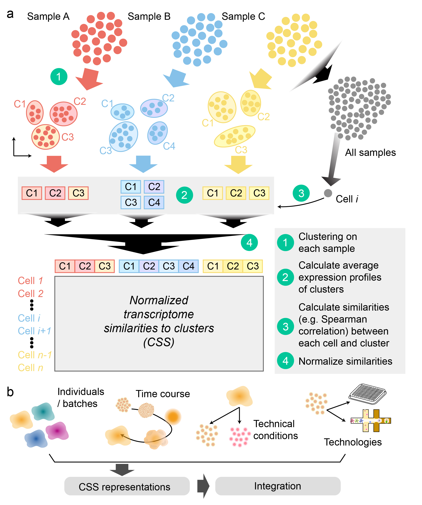
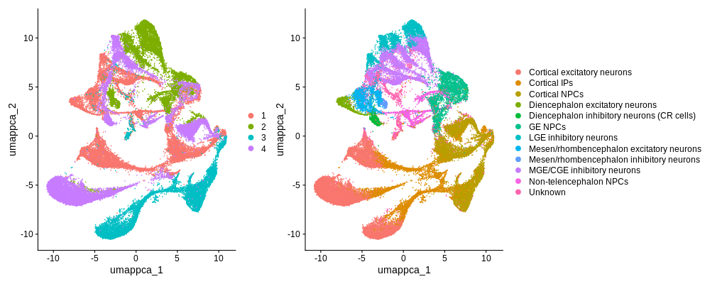
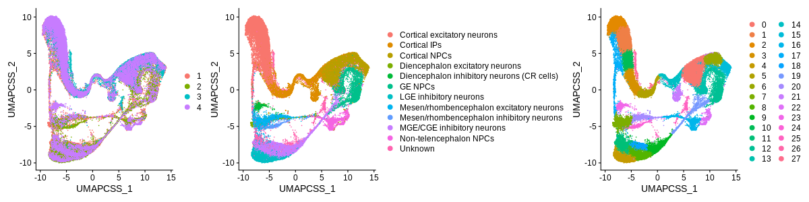
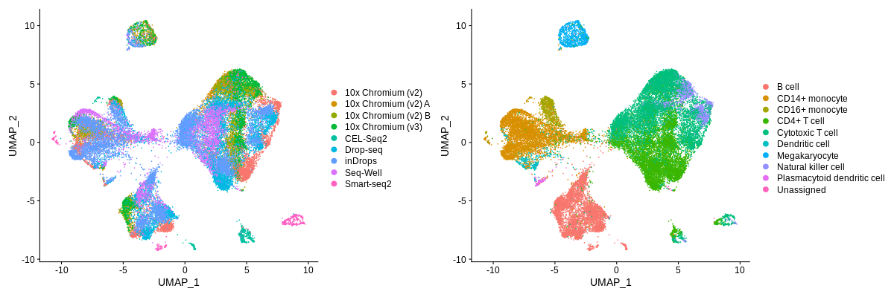
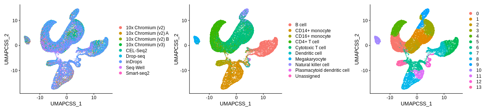

# Tutorial of using CSS to integrate single-cell RNA-seq data
#### Compiled by Zhisong He, Barbara Treutlein
#### Updated on 2020-07-01
### Table of Content
  * [Introduction](#introduction)
  * [Preparation](#preparation)
  * [CSS integration for the cerebral organoid data set](#css-integration-for-the-cerebral-organoid-data-set)
    * [Step 0. Import packages and data](#step-0-import-packages-and-data)
    * [Step 1. Data preprocessing](#step-1-data-preprocessing)
	* [Step 2. CSS calculation](#step-2-css-calculation)
  * [CSS integration for the PBMC data set](#css-integration-for-the-pbmc-data-set)
	* [Step 0-1. Import packages and data and data preprocessing](#step-0-1-import-packages-and-data-and-data-preprocessing)
	* [Step 2. CSS calculation with kernel probability transformation](#step-2-css-calculation-with-kernel-probability-transformation)


## Introduction
Technologies to sequence the transcriptome, genome or epigenome from thousands of single cells in an experiment provide extraordinary resolution into the molecular states present within a complex biological system at any given moment. However, it is a major challenge to integrate single-cell sequencing data across experiments, conditions, batches, timepoints and other technical considerations. New computational methods are required that can integrate samples while simultaneously preserving biological information. Here, we propose an unsupervised reference-free data representation, Cluster Similarity Spectrum (CSS), where each cell is represented by its similarities to clusters independently identified across samples.

The concept of CSS is to represent each cell by its similarities to cell clusters in different samples. As technical variance likely influence different samples in a different way, similarities to clusters of different samples are likely uncomparable. Therefore, a normalization step is applied to similarities normalized across clusters in each sample separately, and the normalized similarities for each cell to different samples are then concatenated.


In principle, the similarity between cells and clusters can be defined in varied ways. Similarly, different normalization strategy can be used. In the *simspec* package we implement to facilitate the CSS calculation supports the use of Spearman correlation (default) or Pearson correlation across a given list of genes (by default, the highly variable genes) as the similarity measurement. Two possible normalization methods are included:
1. Z-transformation
2. Kernel probability

By default, *simspec* package uses Spearman correlation with z-transformation for CSS calculation. This is the preferred option for developmental scRNA-seq data sets with continuous trajectories and intermediate states. On the other hand, Pearson correlation combined with kernel probability normalization is more suitable for data sets with more discrete cell type compositions.

If you are interested in more details of the CSS method and our benchmarking effort to compare it with other integration methods, please refer to this [paper](http://doi.org/10.1101/2020.02.27.968560).

## Preparation
First of all, our implementation of CSS calculation is in the *simspec* R package. It can be installed via *devtools* in R:
```R
# install.packages(devtools)
devtools::install_github("quadbiolab/simspec")
```

This tutorial includes the steps to do integration of two data sets:
1. The 10x scRNA-seq data of 20 two-month-old cerebral organoids with four batches ([Kanton et al. 2019](https://www.nature.com/articles/s41586-019-1654-9))
2. The PBMC scRNA-seq data by Broad Institute ([Ding et al. 2019](https://www.biorxiv.org/content/10.1101/632216v2))

Although the *simspec* package is a stand-alone package which can be run independently, some functions are only supported in the *simspec* implemented CSS calculation Seurat v3 is installed. Therefore, we strongly recommend to preinstall Seurat v3 before using *simspec* for CSS calculation. In *simspec* there is also interfaces to Seurat v3 object implemented so that it can be easier built into the commonly used Seurat-based analysis. This tutorial focuses on how to apply CSS to a data set stored in a Seurat object, so please make sure that Seurat v3 is installed in the R environment.

To retrieve the cerebral organoid data, please refer to the data archive in [Mendeley Data](http://doi.org/10.17632/3kthhpw2pd.2). The file "cerebral_org2m.rds" is the Seurat v3 object of this data set, which can be loaded into R after downloading via
```R
org2m <- readRDS("cerebral_org2m.rds")
```

On the other hand, we can use the *SeuratData* package to retrieve the PBMC scRNA-seq data
```R
library(SeuratData)
InstallData("pbmcsca")
data("pbmcsca")
```

## CSS integration for the cerebral organoid data set
### Step 0. Import packages and data
```R
library(Seurat)
library(simspec)
org2m <- readRDS("cerebral_org2m.rds")
```
### Step 1. Data preprocessing
We need to preprocess the data before CSS calculation. The preprocessing includes data normalization, highly variable features identification, data scaling and PCA
```R
org2m <- NormalizeData(org2m)
org2m <- FindVariableFeatures(org2m, nfeatures = 5000)
org2m <- ScaleData(org2m)
org2m <- RunPCA(org2m, npcs = 20)
```
We can generate the UMAP embedding without integration
```R
org2m <- RunUMAP(org2m, dims = 1:20)
UMAPPlot(org2m, group.by = "batch") + UMAPPlot(org2m, group.by = "celltype_RSS")
```
<br/><br/>


### Step 2. CSS calculation
The calculation of CSS is implemented in the *cluster_sim_spectrum* function. When applying to a Seurat v3 object, two fields are mandatory: *object* and *label_tag*. *object* should be the provided Seurat object, the *label_tag* is the name of a column in the meta.data table that marks the sample/batch information for integration. Here we calculate CSS to integrate organoids. It will take quite a while (approx 15-20 min).
```R
org2m <- cluster_sim_spectrum(object = org2m, label_tag = "organoid")
```
By default, it returns a new Seurat object with an additional reduction object named "css". It can be then used as the reduction methods for following analysis including creating UMAP embedding and clustering. It is worth to mention that all dimensions in the raw CSS output should be used in any following analysis.
```R
org2m <- RunUMAP(org2m, reduction = "css", dims = 1:ncol(Embeddings(org2m, "css")))
org2m <- FindNeighbors(org2m, reduction = "css", dims = 1:ncol(Embeddings(org2m, "css")))
org2m <- FindClusters(org2m, resolution = 1)
UMAPPlot(org2m, group.by = "batch") + UMAPPlot(org2m, group.by = "celltype_RSS") + UMAPPlot(org2m)
```
<br/><br/>

## CSS integration for the PBMC data set
### Step 0-1. Import packages and data and data preprocessing
Similarly, we firstly need to load the packages and data, and do data preprocessing
```R
library(Seurat)
library(SeuratData)
library(simspec)
data("pbmcsca")

pbmcsca <- NormalizeData(pbmcsca)
pbmcsca <- FindVariableFeatures(pbmcsca, nfeatures = 3000)
pbmcsca <- ScaleData(pbmcsca)
pbmcsca <- RunPCA(pbmcsca, npcs = 20)
pbmcsca <- RunUMAP(pbmcsca, dims = 1:20)

UMAPPlot(pbmcsca, group.by = "Method") + UMAPPlot(pbmcsca, group.by = "CellType")
```
<br/><br/>

### Step 2. CSS calculation with kernel probability transformation

```R
pbmcsca <- cluster_sim_spectrum(object = pbmcsca, label_tag = "Method",
                                cluster_resolution = 0.4,
                                corr_method = "pearson",
                                spectrum_type = "corr_kernel")
pbmcsca <- RunUMAP(pbmcsca, reduction = "css", dims = 1:ncol(Embeddings(pbmcsca, "css")))
```
The dimensionality of CSS increases when more samples/batches are to integrate. The high dimensionality can slow down the later analysis. Optionally, we can further reduce the dimensionality by applying an extra PCA
```R
pbmcsca <- run_PCA(pbmcsca, reduction = "css", npcs = 10)
pbmcsca <- RunUMAP(pbmcsca, reduction = "css_pca", dims = 1:10)
pbmcsca <- FindNeighbors(pbmcsca, reduction = "css_pca", dims = 1:10)
pbmcsca <- FindClusters(pbmcsca, resolution = 0.3)
UMAPPlot(pbmcsca, group.by = "Method") + UMAPPlot(pbmcsca, group.by = "CellType") + UMAPPlot(pbmcsca)
```
<br/><br/>

